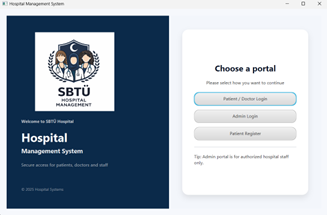
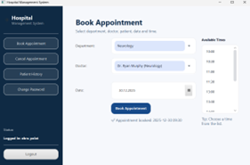

# Hospital Management System

This project is a modular hospital management system developed as a university project.

## Features
- Patient registration
- Appointment scheduling
- Doctor management
- Patient history tracking

## Technologies Used
- Java
- Object-Oriented Programming (OOP)
- JavaFX (GUI)
- File-based data storage

## Purpose
The aim of this project is to simulate a hospital system and improve modular programming skills.

## Author
Ebru Tugce Polat

## Screenshots

